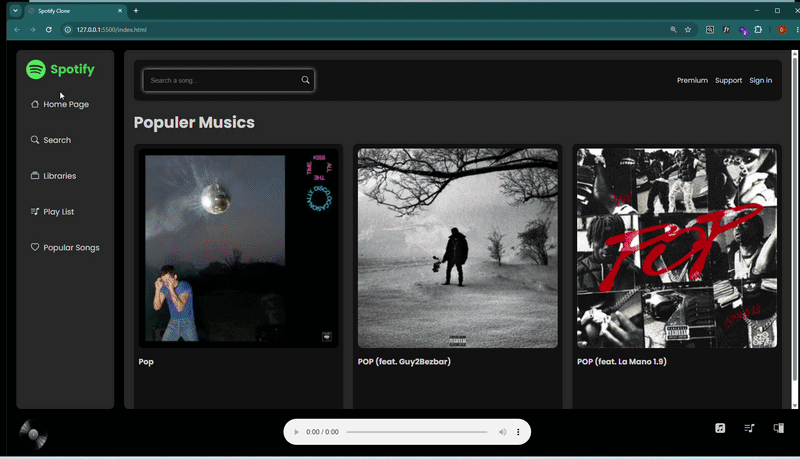

# Spotify Clone 

Spotify Clone is a front-end music discovery app inspired by Spotify's iconic interface.
Built entirely with Vanilla JavaScript and powered by the Deezer API, it lets you search
for any artist or song and instantly preview tracks — no frameworks, no fluff.
Type a name, hit search, and the app fetches real music data in real time, renders
album covers as interactive cards, and drops the selected track into a sleek bottom
player with smooth play/pause animations. A clean, fast, and functional tribute to
one of the world's most-loved music platforms.

 # Features
 Search songs by artist or title
 
🎧Preview tracks directly in the browser

 Dynamic music card rendering
 
 Music player with play/pause animation
 
 Loader animation while fetching data
 
 Responsive layout
 
# Technologies Used
HTML5
CSS3
Vanilla JavaScript (ES6 Modules)
Deezer API via RapidAPI
Bootstrap Icons

## ScreenShot

